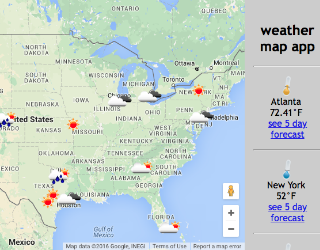

# Weather Map App

## Overview
* A weather map app using AngularJS to show the weather information on a Google Map for various locations. This app uses AngularJS with services and controllers to access different information and display it to the map.

### Technologies, frameworks, & programming Languages used
* HTML5 & CSS3
* JavaScript
* AngularJS
* Google Maps API
* Open Weather Map API

### Url to live demo

[Check it out](http://danielweatherapp.surge.sh/)
